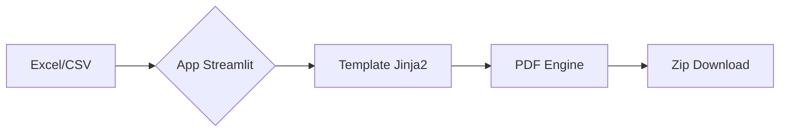

# ⚡ Hube | Gerador de Notas de Débito

Ferramenta de automação desenvolvida para times de **Customer Success e Operações**, focada na transformação eficiente de dados financeiros em documentos PDF (Avisos de Débito) personalizados e profissionais.

---

## 🚀 Fluxo de Funcionamento

O sistema opera através de um pipeline de transformação de dados:

1.  **Input**: Carregamento de base de dados em formato Excel (`.xlsx`) ou `.csv`.
2.  **Processamento**: O motor `Pandas` extrai os dados, que são normalizados pela lógica do `app.py`.
3.  **Renderização**: Uso de templates `Jinja2` para injetar dados no HTML e conversão para PDF via `xhtml2pdf`.
4.  **Output**: Geração de um arquivo comprimido `.zip` contendo todos os documentos individualizados e um relatório de processamento.



---

## 📋 Pré-requisitos de Dados

Para que o mapeamento automático funcione sem erros, sua planilha deve conter as seguintes colunas (ou variações aceitas):

| Campo no PDF | Colunas Aceitas na Planilha |
| :--- | :--- |
| **Destinatário** | `Nome`, `Razão Social`, `Cliente` |
| **Documento** | `CNPJ/CPF`, `CNPJ`, `CPF` |
| **Endereço** | `Endereço`, `Endereco`, `Cidade`, `UF` |
| **Financeiro** | `Total a pagar`, `Total`, `Valor consolidado`, `Total calculado R$` |
| **Datas** | `Vencimento`, `Data de Emissão`, `Mês de Referência` |
| **Identificadores** | `Número da conta`, `Nº da cobrança` |
| **Economia** | `Economia R$`, `Economia mês` |

---

## ☁️ Guia de Deploy (Streamlit Cloud)

Este projeto foi desenhado para rodar em ambientes de nuvem, especificamente no Streamlit Cloud.

### Estrutura do Projeto
O projeto segue uma estrutura modular para facilitar a manutenção e o deploy:

```
Emissor_Notas_Hube/
├── config/             # Configurações do sistema
├── src/                # Código fonte
│   ├── core/           # Lógica de negócio e utilitários
│   ├── services/       # Serviços (PDF Engine)
│   └── interface/      # Interface Streamlit
├── templates/          # Templates HTML
├── tests/              # Testes automatizados
└── requirements.txt    # Dependências Python
```

### Configuração de Segredos
O sistema utiliza o gerenciador de segredos do Streamlit. No painel do Streamlit Cloud, configure os segredos da seguinte forma:

```toml
[passwords]
usuario_exemplo = "senha_segura"
```

### Dependências de Sistema
O arquivo `packages.txt` garante a instalação das bibliotecas gráficas necessárias para a renderização do PDF no ambiente Linux do Streamlit Cloud:
- `libcairo2-dev`
- `pkg-config`
- `python3-dev`

---

## ⚖️ LGPD e Sensibilidade de Dados

- **Privacidade**: Este sistema processa dados sensíveis (CNPJ, CPF e informações financeiras). 
- **Efemeridade**: O processamento é realizado inteiramente em memória. Nenhum dado de entrada ou arquivo gerado é persistido permanentemente no servidor de deploy.
- **Responsabilidade**: O uso e a distribuição dos documentos gerados são de responsabilidade total do operador do sistema.

---

## 📄 Licença

Este projeto está licenciado sob a **Licença MIT**. Sendo fornecido "como está", sem garantias de qualquer tipo, expressas ou implícitas, incluindo, mas não se limitando a, garantias de comercialização ou adequação a um propósito específico.

---
*Desenvolvido para otimização de processos de faturamento e Customer Success.*
